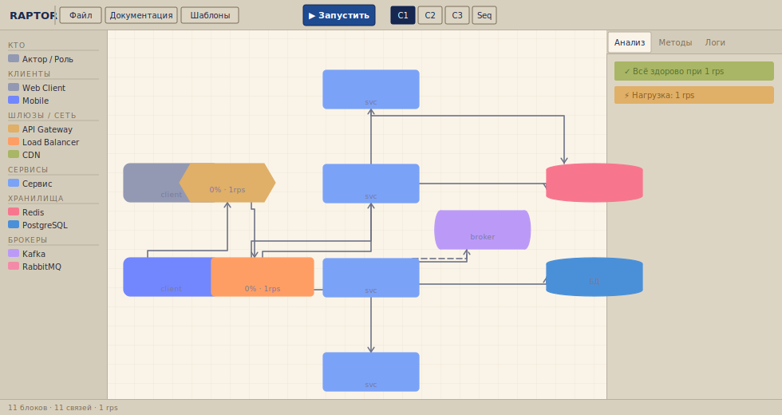

# РАПТОР — конструктор архитектуры

Браузерный инструмент для проектирования, симуляции и документирования архитектуры систем. Работает без установки — открывается в любом браузере.

**[→ Открыть приложение](https://romartamonov-a11y.github.io/raptor/)**

---



---

РАПТОР позволяет нарисовать архитектуру системы в нотации C4: расставить сервисы, базы данных, брокеры и клиентов, соединить их стрелками — и сразу увидеть, как система ведёт себя под нагрузкой. Симулятор гоняет трафик между блоками в реальном времени и показывает утилизацию каждого узла. Живой брокер-инспектор раскрывает внутреннее состояние Kafka, RabbitMQ и NATS: партиции, consumer-groups, DLQ, exchange-топологию.

Встроенный редактор схем строит ERD для PostgreSQL: можно создать схему вручную, импортировать SQL или выбрать один из 23 готовых шаблонов. Из того же проекта генерируется UML Sequence-диаграмма в PlantUML для Confluence и выгружается готовая документация в Word по формату MS-1 — без ручного переписывания.

Для быстрого старта есть 10 групповых шаблонов (E-commerce, Fintech, CQRS, Saga, Mentorship и другие) и 9 шаблонов отдельных сервисов.

## Технологии

Чистый HTML и JS без сборки, npm и фреймворков. Весь проект — набор файлов, которые открываются в браузере напрямую. Для Word-экспорта используется `docx.min.js` локально, без отправки данных на сервер.

## Локальный запуск

```bash
npx serve .
```

Или откройте `index.html` напрямую — большинство функций работает без сервера.
